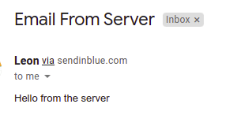
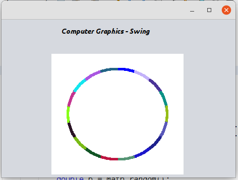
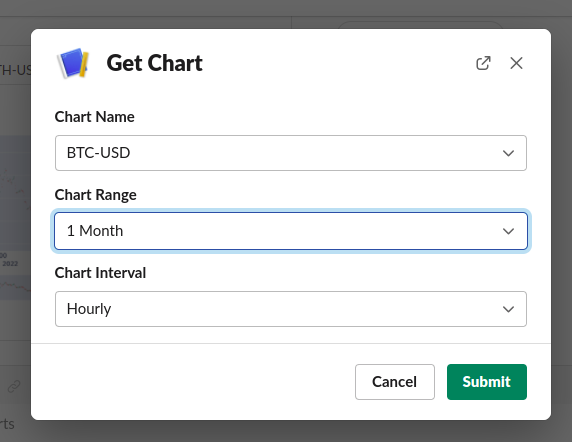
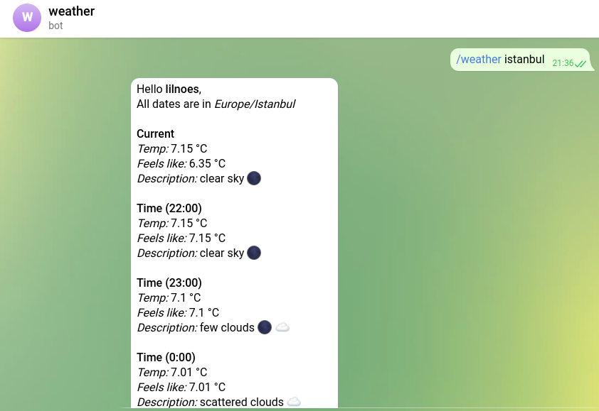

# My Projects
This is a collection of projects that I worked on/created that are hosted on github.
If you want to see a list of all my projects, visit my [website](https://leonema.vercel.app)

## 1. Send Email from server
Send Email from server(nodejs) using sendinblue

Read more [here](https://leonema.vercel.app/projects/send-email-on-the-server-using-sendinblue-free)

Codes available [here](/sendemail)

## 2. Java openGL tutor
Swing desktop app that shows how to use many basic openGL functions, and basics of computer graphics.

Read more [here](https://leonema.vercel.app/projects/learn-opengl-basics-with-java-jogl-and-swing)

Codes available [here](/computer_graphics_jogl)

## 3. Crypto charts to slack
Send/Query crypto chart from server to slack 

Read more [here](https://leonema.vercel.app/projects/slack-crypto-charts)

Codes available [here](/slack_charts)

## 4. Telegram fetch weather
Telegram bot to tell you current api and 10 hour forecast

Read more [here](https://leonema.vercel.app/projects/get-current-weather-conditions-and-forecast-telegram-bot)

Codes available [here](/telegram_weather)